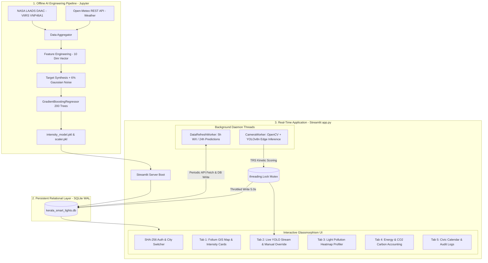

# LumiCity Kerala — Complete Project Documentation & Status Tracker

> **Last Updated:** 2026-10-01  
> **Project Version:** 1.2.0 (Production-Ready)  
> **Target Region:** Kerala, India (8 Municipal Zones)  
> **Maintainer:** Navaneed P ([@navvv29](https://github.com/navvv29))  
> **Repository:** [https://github.com/navvv29/LumiCity](https://github.com/navvv29/LumiCity)

---

## 1. Executive Summary & Vision

**LumiCity Kerala** is an AI-driven Smart City Street Light Management, Predictive Control, and Light Pollution Mitigation system specifically designed for the municipal network across 8 major Kerala urban hubs.

### The Problem
Traditional municipal street lighting is static and binary: mechanical timers switch high-pressure sodium or high-output LED fixtures 100% ON from dusk till dawn (12–14 hours daily). This causes:
1. **Severe Skyglow & Light Pollution:** Scattering of artificial photons off atmospheric humidity, aerosols, and monsoon mist (Rayleigh and Mie scattering), creating luminous artificial domes that disorient wildlife and obscure nocturnal celestial observation.
2. **Ecological & Biological Disruption:** Light trespass into human dwellings suppresses melatonin production, destabilizes circadian rhythms, and disrupts nocturnal avian migration.
3. **Disability Glare:** Excessive, unshielded lumens create high contrast against pitch-black surroundings, constricting human pupils and decreasing actual roadside visibility.
4. **Massive Energy Waste:** Millions of kilowatt-hours are squandered illuminating empty streets between 1:00 AM and 5:00 AM.

### The LumiCity Solution
LumiCity replaces binary timers with a continuous, closed-loop mathematical optimization function:
$$\text{Intensity}_{\text{req}} = f(\text{Time}, \text{Radiance}_{\text{VIIRS}}, \text{Visibility}, \text{TrafficRisk}_{\text{YOLO}}, \text{CelebrationMultiplier}, \text{AmbientLux})$$

LumiCity minimizes light emission down to safe, compliant baselines (e.g., 20–40% during empty deep nights), while instantaneously elevating illumination (up to 100%) during inclement weather (monsoon fog, visibility $< 3000\text{m}$), high-density commuter traffic, or cultural celebrations.

---

## 2. Current Project Status

| Dimension | Status | Notes |
|:---|:---:|:---|
| **Core Dashboard (`app.py`)** | ✅ Production Ready | 1,520 lines of modular Python with custom Glassmorphism CSS |
| **Machine Learning Model** | ✅ Trained & Exported | GradientBoostingRegressor (`intensity_model.pkl`) with $R^2 \approx 0.92$ |
| **Scaler Pipeline** | ✅ Exported | StandardScaler (`intensity_scaler.pkl`) fitting 10 input dimensions |
| **Object Detection (YOLOv8)** | ✅ Integrated | Edge Computer Vision (`yolov8n.pt`) with kinetic energy weighted TRS |
| **Relational Database** | ✅ Populated | SQLite WAL mode (`kerala_smart_lights.db`) across 10 tables & 70 nodes |
| **Autonomous Refresh** | ✅ Active Daemon | `DataRefreshWorker` (5h weather refresh, 24h predictive retraining) |
| **Edge Camera Worker** | ✅ Multi-threaded | `CameraWorker` (decoupled OpenCV capture, mutex lock, 5s write throttle) |
| **Authentication System** | ✅ Secure | SHA-256 hashed credentials across superuser admin and 8 city admins |
| **Dependencies & Environment** | ✅ Documented | `requirements.txt` and `.gitignore` created |
| **GitHub Deployment** | 🚀 Ready for Push | Tracking upstream `https://github.com/navvv29/LumiCity` |

---

## 3. System Architecture & Operational Loops

LumiCity operates through three concurrent, decoupled operational loops:



---

## 4. Machine Learning & Mathematical Formulation

### 4.1 Model Specifications
- **Algorithm:** `scikit-learn.ensemble.GradientBoostingRegressor`
- **Ensemble Depth:** `n_estimators = 200`, `max_depth = 4`, `learning_rate = 0.1`
- **Pre-processing:** `StandardScaler` (zero mean, unit variance)
- **Why GBR over Neural Nets?** Decision tree ensembles are explainable, robust to tabular heteroskedasticity, require minimal compute envelopes, and provide predictable boundaries essential for municipal safety compliance.

### 4.2 Feature Matrix ($X \in \mathbb{R}^{10}$)
1. `hour` (0–23): Fractional/hourly diurnal position.
2. `weekday` (0–6): Day of the week.
3. `is_weekend` (0 or 1): Binary flag capturing late-night traffic surges.
4. `month` (1–12): Captures seasonal monsoon cloudiness and solar sunset variations.
5. `is_poor_visibility` (0 or 1): Evaluates to 1 when Open-Meteo visibility $< 3000\text{ m}$.
6. `viirs_radiance` ($\text{nW}\cdot\text{cm}^{-2}\cdot\text{sr}^{-1}$): NASA Day/Night Band historical ground truth.
7. `celebration_multiplier` (1.0–2.0): Regional festival multiplier from `celebration_calendar`.
8. `traffic_proxy` (0.1–1.5): Harmonic commuter proxy calculated via overlapping sinusoids:
   $$\text{TrafficFactor} = \max\left(0.1, \sin\left(\frac{\pi(h - 4)}{12}\right) + 0.5 \cos\left(\frac{\pi h}{6}\right)\right)$$
   $$\text{traffic\_proxy} = \text{viirs\_radiance} \times \text{TrafficFactor}(h)$$
9. `latitude` (Float): Physical fixture GPS latitude.
10. `longitude` (Float): Physical fixture GPS longitude.

### 4.3 Training Target Generation ($y$) & Noise Injection
To prevent the model from collapsing into a pure mathematical memorization calculator ($R^2 = 1.0$), an intentional 6% Gaussian distribution noise was injected:
$$y = y_{\text{ideal}} + \mathcal{N}(0, 6)$$
$$y = \text{clip}(y, 0, 100)$$

This regularization forces the decision trees to construct smooth, generalized multidimensional hyperplanes ($R^2 \approx 0.92$, $\text{MAE} < 3.5\%$, $\text{RMSE} < 4.8\%$).

---

## 5. Real-Time Dynamic Intensity Blending

Every frame rendered on the dashboard or evaluated by the physical controller computes intensity through `compute_base_intensity()`:

```
t = sim_hour + sim_minute / 60.0
Anchors: [(0.0, 40), (0.5, 32), (1.0, 20), (3.0, 18), (5.0, 20), (5.5, 10), (6.0, 0),
          (17.5, 0), (18.0, 40), (18.25, 48), (18.5, 55), (19.0, 70), (19.5, 69),
          (20.0, 66), (20.5, 62), (21.0, 55), (21.5, 50), (22.0, 48),
          (22.5, 44), (23.0, 40), (23.5, 38), (24.0, 40)]
```

1. **Spline Interpolation:** Continuous linear interpolation across the 21 anchors prevents jarring step-function illumination changes, protecting motorist vision.
2. **Weather Safety Floor:** If `is_poor_visibility` is active, $\text{Base} \ge 60\%$.
3. **AI Blending:** Nighttime hours blend the ML prediction with the anchor curve:
   $$\text{FinalBase} = 0.7 \times \text{AI\_Prediction} + 0.3 \times \text{AnchoredBase}$$
4. **Civic Multipliers:** Scaled up by active festival multipliers in `celebration_calendar`.
5. **Camera Surveillance Boost:** If the live camera is streaming, adds the YOLOv8 TRS boost (up to $+40\%$).

---

## 6. Edge Computer Vision (YOLOv8 & TRS)

The system deploys Ultralytics YOLOv8 nano (`yolov8n.pt`) inside the `CameraWorker` daemon thread.

### Kinetic Energy TRS Scoring
Detected objects are filtered for road users and weighted according to physical kinetic momentum ($K = \frac{1}{2}mv^2$):
- **Person (`cls: 0`):** 1.0 (Vulnerable pedestrian)
- **Bicycle (`cls: 1`):** 1.2
- **Car (`cls: 2`):** 2.0 (Standard vehicle)
- **Motorcycle (`cls: 3`):** 1.5
- **Bus (`cls: 5`):** 3.5 (High momentum transit)
- **Truck (`cls: 7`):** 3.5 (Heavy commercial freight)

$$\text{TRS} = \sum_{i \in \text{Detections}} \text{Weight}(cls_i)$$

### Dynamic Boost Staircase
- $\text{TRS} \ge 15.0 \implies +40\%$ boost (Traffic congestion / multi-vehicle jam)
- $\text{TRS} \ge 10.0 \implies +30\%$ boost (Dense vehicular traffic)
- $\text{TRS} \ge 5.0 \implies +20\%$ boost (Moderate flow)
- $\text{TRS} \ge 2.0 \implies +10\%$ boost (Sporadic traffic)
- $\text{TRS} < 2.0 \implies +0\%$ boost (Quiet roadway; revert to baseline)

### Concurrency & Performance Hardening
- **Downsampling:** Inference occurs every 4th frame (`infer_every=4`), reducing CPU load by 75% while maintaining ~7.5 FPS tracking.
- **Mutex Isolation:** Thread-safe state snapshots via `threading.Lock()` prevent race conditions with the Streamlit main thread.
- **Throttling:** SQLite writes to `detection_events` are strictly limited to one transaction every 5.0 seconds to prevent file locking and SSD IOPS degradation.

---

## 7. Relational Database Schema (`kerala_smart_lights.db`)

The SQLite database operates in **WAL (Write-Ahead Logging)** mode with `timeout=10` to enable concurrent reads and writes without contention:

1. `city_zones`: Municipal boundaries (`city_code`, center GPS, bounding box lat/lon).
2. `street_lights`: Registry of 70 smart fixtures (`light_id`, `city_code`, GPS coordinates, location name, fixture type, pole height, wattage).
3. `weather_data`: Meteorological observations (`city_code`, `timestamp`, `cloudcover`, `visibility`, `is_poor_visibility`, `fetched_at`).
4. `viirs_data`: Satellite radiance measurements (`date`, `light_id`, `raw_radiance`, `skyglow_index`, `quality_flag`).
5. `predictions`: 24-hour predictive forecast matrix (`prediction_made_at`, `target_timestamp`, `light_id`, `predicted_intensity`, confidence bounds, day type, multiplier).
6. `celebration_calendar`: Festival and event schedule (`event_date`, `event_name`, `multiplier`, `city_code`).
7. `detection_events`: Edge computer vision logs (`minute_ts`, `light_id`, `trs_avg`, `trs_max`, `intensity_boost`, `final_intensity`).
8. `override_events`: Municipal manual intervention audit trail (`ts`, `light_id`, `user`, `previous_value`, `new_value`, `override_type`).
9. `model_metrics`: Historical model training audit records (`trained_at`, `model_type`, `mae`, `rmse`, `r2`, `custom_accuracy`).
10. `system_log`: Autonomous daemon status and diagnostic messages (`ts`, `level`, `component`, `message`).

---

## 8. Municipalities & User Authentication

Authentication is backed by SHA-256 hashes stored in `credentials.json`.

| Username | Password | Role | Municipal Jurisdiction |
|:---|:---|:---|:---|
| `admin` | `admin123` | **Superuser** | All 8 Kerala Municipalities (Switchable) |
| `tvm_admin` | `tvm123` | Municipal Admin | Thiruvananthapuram (`TVM`) |
| `kch_admin` | `kochi123` | Municipal Admin | Kochi (`KCH`) |
| `kzd_admin` | `kzd123` | Municipal Admin | Kozhikode (`KZD`) |
| `tcr_admin` | `tcr123` | Municipal Admin | Thrissur (`TCR`) |
| `klm_admin` | `klm123` | Municipal Admin | Kollam (`KLM`) |
| `knr_admin` | `knr123` | Municipal Admin | Kannur (`KNR`) |
| `alp_admin` | `alp123` | Municipal Admin | Alappuzha (`ALP`) |
| `pkd_admin` | `pkd123` | Municipal Admin | Palakkad (`PKD`) |

---

## 9. File Manifest for GitHub Repository

```
LumiCity/
├── .gitignore                          # Git ignore specification
├── requirements.txt                    # Python package dependencies
├── DOCUMENTATION.md                    # Exhaustive technical system documentation
├── README.md                           # Detailed public repository guide
├── app.py                              # Core Streamlit dashboard (1,520 lines)
├── LumiCity_AI.ipynb                   # End-to-end ML training & data pipeline
├── credentials.json                    # SHA-256 hashed login credentials
├── kerala_smart_lights.db              # Pre-seeded SQLite database (10 tables, 70 nodes)
├── intensity_model.pkl                 # Serialized Gradient Boosting Regressor
├── intensity_scaler.pkl                # Serialized StandardScaler pipeline
├── yolov8n.pt                          # YOLOv8 nano edge computer vision weights
├── LumiCity_Documentation.pdf          # Full academic documentation report
├── LumiCity_Kerala_Full_Documentation.pdf # 58-page comprehensive architectural deep-dive
├── LumiCity_Run_Guide.pdf              # Quick operational run and troubleshooting guide
└── viirs_*.h5 (15 files)               # Sample NASA VIIRS Day/Night Band HDF5 granules
```

---

## 10. Execution & Run Instructions

```bash
# 1. Clone repository
git clone https://github.com/navvv29/LumiCity.git
cd LumiCity

# 2. Set up virtual environment
python -m venv .venv
.venv\Scripts\Activate.ps1    # On Windows PowerShell
# source .venv/bin/activate   # On Linux/macOS

# 3. Install dependencies
pip install --upgrade pip
pip install -r requirements.txt

# 4. Launch Streamlit portal
streamlit run app.py
```

---

## 11. Maintenance & Version History

- **v1.0.0:** Initial Streamlit prototype with basic timer controls.
- **v1.1.0:** Integrated NASA VIIRS VNP46A1 radiance data ingestion and Gradient Boosting ML regression.
- **v1.2.0:** Integrated YOLOv8 edge computer vision, asynchronous daemon threads (`CameraWorker`, `DataRefreshWorker`), glassmorphism UI theme, and multi-city municipal authentication.
